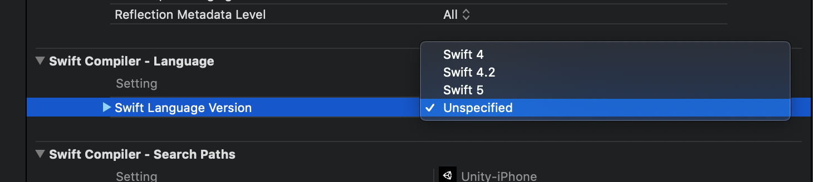

# Unity-Hello-Swift
This project demonstrates how to create a Swift plugin for Unity and 'automatically' calls some callback such as OnUnityPluginLoad etc.

# Version
Unity 2019.1.7f1 

Xcode 10.2.1

# Note
Unity doesn't set the Swift Version, so you have to do it yourself or write a postprocess script to set it.

Set the Swift Version to 5.0.

# Ref
[Implementing Swift in Unity
](https://medium.com/@kevinhuyskens/implementing-swift-in-unity-53e0b668f895)
